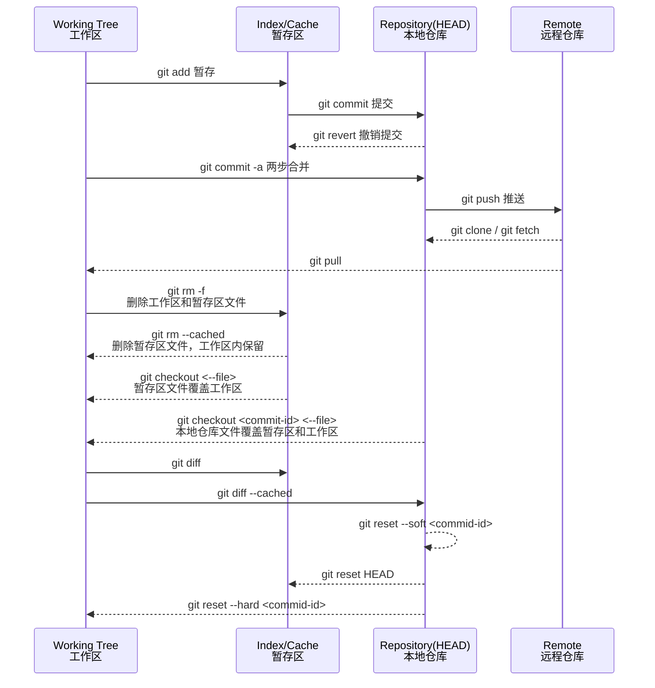
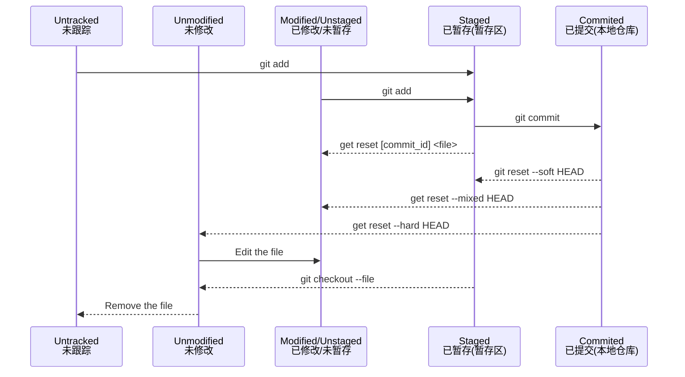

## 外部连接

[45 个 Git 经典操作场景，专治不会合代码](https://mp.weixin.qq.com/s/uEMTl6uZWCk6bv7KiuBy5g)

## 一、创建版本库

``` python
git clone http://gitee.com/fengzhaoy/mypro.git #克隆git项目到本地 默认master分支
git init #初始化本地版本库
git remote add origin https//gitee.com/fengzhaoy/mypro.git
git push
git add .; git commit -m 'fix'
git push origin master
```

## 二、修改和提交

``` python
git status #查看文件状态，列出当前目录没有被git管理，以及被修改过还未提交的文件
git add . #将提交的文件添加到索引库中（添加到暂存区），*可以是路径也可以是.符号
git add . #代表当前目录下的所有文件都添加到索引库中，如果指定路径则代表将指定路径的文件添加到索引库中
git rm -rf <file> #删除本地指定文件
git commit -m 'fix' #提交到本地仓库并加注释，这一步仅仅是放在缓冲区中，还未真正提交到远程
git comit -am 'update' #等于 "git add ." + "git comit -m 'update'"
```

### 仓库图



### 文件状态图



### 移动指针 git reset --参数

|                 | Working Directory<br />工作区 - git add -> | Index/Cache<br />暂存区 - git commit -> | Repository (HEAD)<br />本地仓库 commit last_id (HEAD) |
| --------------- | ------------------------ | ----------- | ----------------- |
| --soft          | 1                        | 1           | 0                 |
| --mixed (default) | 1                        | 0           | 0                 |
| --hard          | 0                        | 0           | 0                 |

## 删除 git rm --参数


## 三、查看提交历史

```python
git log #查看提交历史
git log --graph #查看分支合并图
git log -p <file> #查看指定文件提交历史
git blame <file> #以列表方式查看指定文件的提交历史
```

## 四、撤销修改

```python
git reset --hard HEAD #还原本地未提交的更改
git checkout . #本地所有修改的未提交的，都返回到原来的状态
git checkout HEAD <file> #撤消指定未提交文件的修改内容
git revert <COMMIT> #撤消指定的提交，当用revert撤消时，它会产生新的提交
git stash #把所有没有提交的修改暂存到stash里面，可用 git stash pop 恢复
git reset --soft #软回溯，回退commit的同时保留修改内容
```

## 五、分支与标签

```python
git branch <new-branch> #创建新分支
git checkout <branch/tag> #切换到指定分支或标签
git checkout -b <branch> #创建分支并切换到新分支，等于上面两步
git branch #显示所有本地分支
git branch -a #显示所有本地分支和远程分支
git push origin --delete <branch> 删除远程分支
git branch -d <branch> #删除本地分支
git branch the_branch_backup #备份一下这个分支当前的情况
git tag #列出所有本地标签
git tag <tagname> #基于最新摇曳多姿创建标签
git tag -d <tagname> #删除标签
```

## 六、合并与衍合

```python
git merge <branch> #当前分支合并其它分支
git rebase <branch> #衍合指定分支到当前分支
```

## 七、远程操作

```python
git pull #拉取远程所有分支代码合并到本地
git pull origin <branch> #更新当前分支的代码，获取最新的代码 如：git pull origin dev

git pull #强制覆盖本地的代码方式，下面是正确的方法：
git fetch --all #从远程下载最新的，而不尝试合并或rebase任何东西
git reset --hard origin/master #将主分支重置为您刚刚获取的内容，--hard选项更改工作树中的所有文件以匹配origin/master中的文件。
git reset --hard origin/<branch_name> #或者如果你在其它分支上

git push origin <branch> #上传代码及快速合并到远程branch 仓库 如：git push orgin dev
git push origin :<branch/tag-name> #删除远程分支或标签
git push --tags #上传所有标签

git fetch用法：
cat .git/FETCH_HEAD #查看FECTH_HEAD内容
git fetch origin master:tmp #在本地新建一个tmp分支，并交远程origin仓库的master分支代码下载到本地tmp分支
git diff tep #比较本地代码与刚刚从远程下载下来的代码的区别
git fetch <remote> #从远程库获取代码

git remote -v #查看远程版本库信息
git remote show <remote> #查看指定远程版本信息
git remote add <remote> <url> #添加远程版本库
```

## 八、全局配置

```python
git config --global user.name '杨' #设置用户名
git config --global user.email ‘zhaoyang10@1633.com' #设置邮箱
#idea存储git的账号和密码
1. 在项目根目录下执行以下git命令：
git config --global credential.helper store
2. 执行上述命令后，在idea中第一次pull或push 需要输入用户名和密码，之后 就不用再输入了。
```

## 九、代码回滚

```python
#代码库回滚：指的是将代码库某分支退回到以前的某个commit id
#本地代码库回滚：
git reset --hard commit-id #回滚到commit-id， 将commit-id之后提交的commit都去除
git reset --hard HEAD~3 #将最近3次的提交回滚

#远程代码库回滚：
#应用场景：自动部署系统发布后发现问题，需要回滚到某一个commit，再重新发布
#原理：先将本地分支退回到某个commit，删除远程分支，再重新push本地分支
#操作步骤：
1. git checkout the_branch #切换到指定分支
2. git pull #拉取
3. git branch the_branch_backup #备份一下这个分支的当前情况
4. git reset --hard the_commit_id #把 the_branch 本地回滚到the_commit_id
5. git push origin :the_branch #删除远程 the_branch
6. git push origin the_branch #用回滚后的本地分支重新建立远程分支
7. git push origin :the_branch_bacckup #如果前面都成功了，删除这个备份分支
```

## 十、master分支代码回滚

```python
git checkout master #切换到master
git checkout -b rollback #复制master分支，创建回滚分支rollback
git reset --hard 258e9d8a #回滚rollback分支到指定的版本
git push origin rollback #rollback分支提交到远程
最后用rollback分支上线回滚版本
```

## 十一、分支重命名

```python
git branch -m oldName newName #本地分支名改修改 (还没推送到远程)

#远程分支名重命名，（已经推送到远程，假设本地分支各远程对应分支名称相同）
1 git branch -m oldName newName #本地分支重命名
2 git push --delete orgin oldName #删除远程分支
3 git push orgin newName #上传新命名的本地分支
4 git branch --set-upstream-to origin/newName #把修改后的本地分支与远程分支关联
```

## 十二、拉取远程分支到本地

```python
git branch -r #查看所有分支
#拉取远程分支并创建本地分支
git checkout -b <本地分支名> origin/<远程分支名> #1.本地新建分支 2.切换到新建分支 3.新建分支与远程分支建立关联
#或
1. git fetch origin <远程分支名>:<本地分支名> #1.本地新建分支
  +
2. git checkout <本地分支名> #2.切换本地分支
  +
3. git branch --set-upstream-to origin/<远程分支名> #3.本地分支与远程分支建立关联

git branch -vv #查看本地分支与远程分支的关系，最近一条有蓝色字表示关联上了
```

## 十三、分支合并

```python
dev-->提交1-->提交2-->提交3-->提交N-->dev
  |
  |-->job-->提交1-->提交2-->提交N-->job
#1.一个原始dev分支
#2.通过dev分支新建了一个job分支，我在job分支上开发
#3.两个分支独自开发，完成各自功能
#4.将job分支合并到dev分支

#操作
1. git checkout dev #切换到dev分支
2. git merge job #在dev分支上合并job代码，解决冲突
3. git add . #新文件添加到暂存区
4. git commit -m '合并job功能' #提交到本地仓库
5. git push #推送dev
6. job功能完成，删除job分支

#如果还要用job继续开发
1. git checkout job #切换到job分支
2. git merge dev #dev合并到job分支
3. git push origin job #推送job
```

## 十四、git merge 合并 和 git rebase 变基

```python
#一、git merge 会把两个分支的最新快照以及二者最近的公共祖先进行三方合并，合并的结果是生成一个新的快照（并提交）
#dev合并到master
1. git checkout master #切换到master分支
2. git pull #拉取最新代码
3. git merge dev #合并dev代码到master
4. ... 解决冲突
5. git push 提交

#二、git rebase 先找到两个分支（master 与 dev）的最近公共祖先，然后对比 dev 分支对于该祖先的历次提交，提取相应的修改并存为临时文件，然后将当前分支指向目标分支（master）的最新一次的提交，最后将之前另存为临时文件的修改依序应用
#dev合并到master
1. git checkout master #切换到master分支
2. git pull #拉取最新代码
3. git checkout dev #切换到dev分支
4. git rebase master #执行变基，dev分支上的历次修改追加到master上

	# 不知道这两步有没有必要
    5. git checkout master #切换到master分支 
    6. git merge dev #合并dev代码到master
    
7. git push
```


## 十五、提交规范

```python
<type>(<scope>): <subject>
type: 用于说明commit 的类别，只允许使用下面7个标识
	1. feat: 新功能（feature)
    2. fix: 修补bug
    3. docs: 文档(documentation)
    4. style: 格式(不影响代码运行的变动)
    5. refactor: 重构(即不是新增功能，也不是修改bug的代码变动)
    6. test: 增加测试
    7. chore: 构建过程或辅助工具的变动
scoppe: 用于说明commit影响的范围，比如数据层、控制层、视图层等
subject: 是commit 目的的简短描述，不超过50个字符
	1. 以动词开头，使用第一人称现在时，比如change,而不是changed哐changes
    2. 第一个字母小写
    3. 结尾不加句号(.)
```

## 十六、git tag

Tag类似于branch,区别是branch是可以不断改变、Merge的，而Tag不行。Tag可以认为是一个快照、一个记录点，用于记录某个commit点或分支的历史快照。Tag通常打在Master分支上，以保证代码的准确性。

```python
git tag <Tag名字> #创建Tag，默认记录在最后的提交上
git tag <Tag名字> <SHA-1 Code>  #通过commit id 指定要创建Tag 的地方
git tag -a <Tag名字> -m <注释文字> <SHA-1 Code> #创建带标签的Tag
#SHA-1 Code 不需要全部写完，只要写前6、7 位就差不多了，Git就可以查找到相应的id了
git tag #查看tag
git show <Tag名字> #查看指定tag的详细信息
git tag -d <Tag名字> #删除tag
git push origin <Tag名字> #推送tag到远程
git push origin --tags #推送所有tag

#删除远程tag，需要先删除本地tag，再推送到远程
1. git tag -d <Tag名字>
2. git push origin :refs/tags/<Tag名字>
```

## 十七、常用命令速查表


